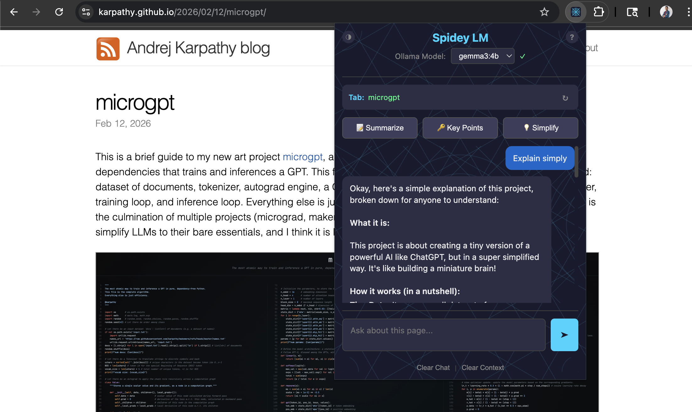
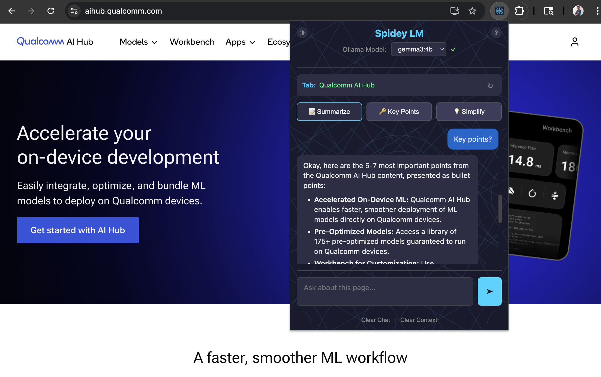

# Spidey LM

Your friendly neighborhood Chrome extension for browsing with AI superpowers - running **100% on your device**.

## Why On-Device?

- **Complete Privacy** - Your browsing data never leaves your machine. No cloud APIs, no data collection, no tracking.
- **No API Keys** - No subscriptions, no rate limits, no usage fees. Just you and your local AI.
- **Works Offline** - Once set up, works without internet (except for the pages you're browsing).
- **Your Data, Your Control** - Page content stays local. Chat history stays local. Everything stays local.

## Features

- **Summarize** any web page instantly
- **Extract key points** from articles and documents
- **Simplify** complex content into plain language
- **Chat** with any page - ask custom questions about the content
- **Multiple themes** - Classic Spidey, Symbiote, Miles Morales, Spider-Gwen, and more
- **Markdown support** - Rich formatted responses with code highlighting
- **Model selection** - Use any of your downloaded Ollama models
- **Auto-capture** - Quick actions automatically grab the current tab content

## Demo

### Simplify Content
<video src="assets/simplify_ai_hub.mov" controls width="600"></video>

### Summarize GitHub Issues
<video src="assets/issue_summary.mov" controls width="600"></video>

| Simplify content | Key points extraction |
|:--:|:--:|
|  |  |

## Prerequisites

- [Ollama](https://ollama.ai) installed and running
- At least one model downloaded (e.g., `ollama pull llama3.2`)

## Setup

### 1. Configure Ollama for Chrome Extension Access

Chrome extensions require CORS access to localhost. Run this once:

```bash
launchctl setenv OLLAMA_ORIGINS "*"
```

Then quit and restart the Ollama app.

**Alternative:** Start Ollama from terminal with:
```bash
OLLAMA_ORIGINS="*" ollama serve
```

### 2. Install the Extension

1. Open Chrome and go to `chrome://extensions`
2. Enable "Developer mode" (toggle in top right)
3. Click "Load unpacked"
4. Select the `extension` folder from this repo

### 3. Download a Model (if you haven't)

```bash
ollama pull llama3.2
```

Recommended models:
- `llama3.2` - Fast and lightweight, great for quick summaries
- `llama3.2:1b` - Ultra-fast, minimal resources
- `mistral` - Good balance of speed and quality
- `gemma2` - Strong performance, efficient
- `llama3.1` - More capable, needs more RAM

## Usage

1. Click the Spidey LM icon in your Chrome toolbar
2. Select your preferred model from the dropdown
3. Use quick actions (Summarize, Key Points, Simplify) or ask your own questions
4. Click the theme button (top-left) to switch between Spider-verse themes

Quick actions automatically capture the current tab - no need to manually refresh context.

## Testing

Run unit tests:

```bash
cd extension
npm install
npm test
```

Run tests in watch mode:

```bash
npm run test:watch
```

## Troubleshooting

### "Ollama error: 403"
Ollama isn't configured for Chrome extension access. See Setup step 1.

### "Ollama not running"
Start Ollama app or run `ollama serve` in terminal.

### "No models available"
Download a model: `ollama pull llama3.2`

## License

Apache 2.0
